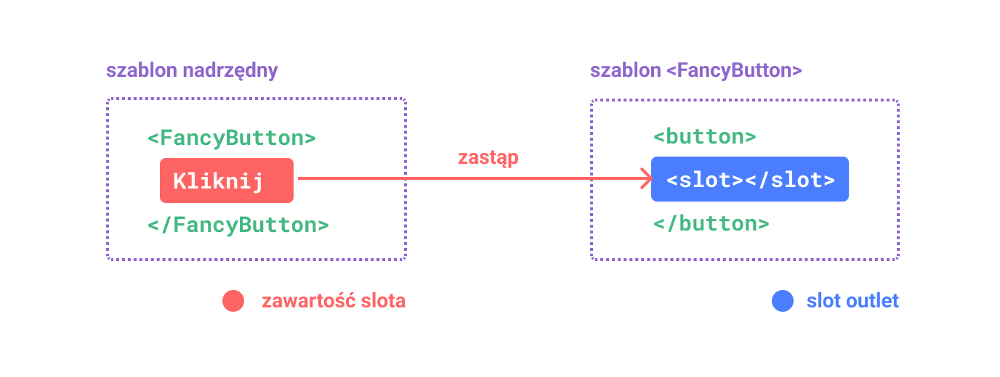
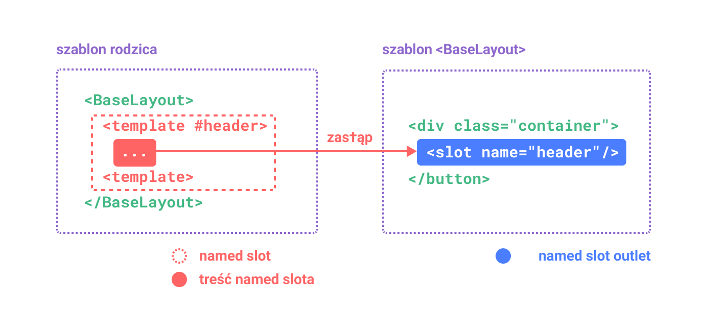
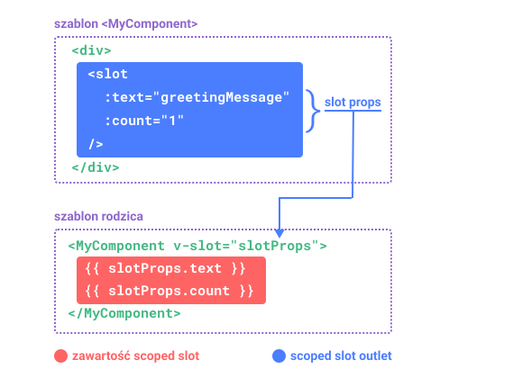

# Sloty {#slots}

> Ta strona zakłada, że przeczytałeś już [Podstawy Komponentów](/guide/essentials/component-basics). Przeczytaj je najpierw, jeśli dopiero zaczynasz pracę z komponentami.

<VueSchoolLink href="https://vueschool.io/lessons/vue-3-component-slots" title="Free Vue.js Slots Lesson"/>

## Zawartość Slotów i Outlet {#slot-content-and-outlet}

Dowiedzieliśmy się, że komponenty mogą przyjmować właściwości (props), które mogą być wartościami JavaScript dowolnego typu. Ale co z zawartością szablonu? W niektórych przypadkach możemy chcieć przekazać fragment szablonu do komponentu potomnego i pozwolić mu wyrenderować ten fragment w swoim własnym szablonie.

Na przykład, możemy mieć komponent `<FancyButton>`, który wspiera użycie w taki sposób:

```vue-html{2}
<FancyButton>
  Click me! <!-- zawartość slotu -->
</FancyButton>
```

Szablon `<FancyButton>` wygląda następująco:

```vue-html{2}
<button class="fancy-btn">
  <slot></slot> <!-- zawartość slotu -->
</button>
```

Element `<slot>` jest **outletem slotu**, który wskazuje, gdzie powinna zostać wyrenderowana **zawartość slotu** dostarczona przez rodzica.



<!-- https://www.figma.com/file/LjKTYVL97Ck6TEmBbstavX/slot -->

A końcowy wyrenderowany DOM:

```html
<button class="fancy-btn">Wciśnij mnie!</button>
```

<div class="composition-api">

[Wypróbuj na Playground](https://play.vuejs.org/#eNpdUdlqAyEU/ZVbQ0kLMdNsXabTQFvoV8yLcRkkjopLSQj596oTwqRvnuM9y9UT+rR2/hs5qlHjqZM2gOch2m2rZW+NC/BDND1+xRCMBuFMD9N5NeKyeNrqphrUSZdA4L1VJPCEAJrRdCEAvpWke+g5NHcYg1cmADU6cB0A4zzThmYckqimupqiGfpXILe/zdwNhaki3n+0SOR5vAu6ReU++efUajtqYGJQ/FIg5w8Wt9FlOx+OKh/nV1c4ZVNqlHE1TIQQ7xnvCN13zkTNalBSc+Jw5wiTac2H1WLDeDeDyXrJVm9LWG7uE3hev3AhHge1cYwnO200L4QljEnd1bCxB1g82UNhe+I6qQs5kuGcE30NrxeaRudzOWtkemeXuHP5tLIKOv8BN+mw3w==)

</div>
<div class="options-api">

[Wypróbuj na Playground](https://play.vuejs.org/#eNpdUdtOwzAM/RUThAbSurIbl1ImARJf0ZesSapoqROlKdo07d9x0jF1SHmIT+xzcY7sw7nZTy9Zwcqu9tqFTYW6ddYH+OZYHz77ECyC8raFySwfYXFsUiFAhXKfBoRUvDcBjhGtLbGgxNAVcLziOlVIp8wvelQE2TrDg6QKoBx1JwDgy+h6B62E8ibLoDM2kAAGoocsiz1VKMfmCCrzCymbsn/GY95rze1grja8694rpmJ/tg1YsfRO/FE134wc2D4YeTYQ9QeKa+mUrgsHE6+zC+vfjoz1Bdwqpd5iveX1rvG2R1GA0Si5zxrPhaaY98v5WshmCrerhVi+LmCxvqPiafUslXoYpq0XkuiQ1p4Ax4XQ2BSwdnuYP7p9QlvuG40JHI1lUaenv3o5w3Xvu2jOWU179oQNn5aisNMvLBvDOg==)

</div>

Dzięki slotom, `<FancyButton>` jest odpowiedzialny za renderowanie zewnętrznego `<button>` (oraz jego ozdobnego stylowania), podczas gdy wewnętrzna zawartość jest dostarczana przez komponent nadrzędny.

Innym sposobem na zrozumienie slotów jest porównanie ich do funkcji JavaScript:

```js
// komponent nadrzędny przekazujący zawartość slotu
FancyButton('Wciśnij mnie!')

// FancyButton renderuje zawartość slotu w swoim własnym szablonie
function FancyButton(slotContent) {
  return `<button class="fancy-btn">
     ${slotContent}
   </button>`
}
```

Zawartość slotu nie jest ograniczona tylko do tekstu. Może to być dowolna prawidłowa zawartość szablonu. Na przykład, możemy przekazać wiele elementów, a nawet inne komponenty:

```vue-html
<FancyButton>
  <span style="color:red">Wciśnij mnie!</span>
  <AwesomeIcon name="plus" />
</FancyButton>
```

<div class="composition-api">

[Wypróbuj na Playground](https://play.vuejs.org/#eNp1UmtOwkAQvspQYtCEgrx81EqCJibeoX+W7bRZaHc3+1AI4QyewH8ewvN4Aa/gbgtNIfFf5+vMfI/ZXbCQcvBmMYiCWFPFpAGNxsp5wlkphTLwQjjdPlljBIdMiRJ6g2EL88O9pnnxjlqU+EpbzS3s0BwPaypH4gqDpSyIQVcBxK3VFQDwXDC6hhJdlZi4zf3fRKwl4aDNtsDHJKCiECqiW8KTYH5c1gEnwnUdJ9rCh/XeM6Z42AgN+sFZAj6+Ux/LOjFaEK2diMz3h0vjNfj/zokuhPFU3lTdfcpShVOZcJ+DZgHs/HxtCrpZlj34eknoOlfC8jSCgnEkKswVSRlyczkZzVLM+9CdjtPJ/RjGswtX3ExvMcuu6mmhUnTruOBYAZKkKeN5BDO5gdG13FRoSVTOeAW2xkLPY3UEdweYWqW9OCkYN6gctq9uXllx2Z09CJ9dJwzBascI7nBYihWDldUGMqEgdTVIq6TQqCEMfUpNSD+fX7/fH+3b7P8AdGP6wA==)

</div>
<div class="options-api">

[Wypróbuj na Playground](https://play.vuejs.org/#eNptUltu2zAQvMpGQZEWsOzGiftQ1QBpgQK9g35oaikwkUiCj9aGkTPkBPnLIXKeXCBXyJKKBdoIoA/tYGd3doa74tqY+b+ARVXUjltp/FWj5GC09fCHKb79FbzXCoTVA5zNFxkWaWdT8/V/dHrAvzxrzrC3ZoBG4SYRWhQs9B52EeWapihU3lWwyxfPDgbfNYq+ejEppcLjYHrmkSqAOqMmAOB3L/ktDEhV4+v8gMR/l1M7wxQ4v+3xZ1Nw3Wtb8S1TTXG1H3cCJIO69oxc5mLUcrSrXkxSi1lxZGT0//CS9Wg875lzJELE/nLto4bko69dr31cFc8auw+3JHvSEfQ7nwbsHY9HwakQ4kes14zfdlYH1VbQS4XMlp1lraRMPl6cr1rsZnB6uWwvvi9hufpAxZfLryjEp5GtbYs0TlGICTCsbaXqKliZDZx/NpuEDsx2UiUwo5VxT6Dkv73BPFgXxRktlUdL2Jh6OoW8O3pX0buTsoTgaCNQcDjoGwk3wXkQ2tJLGzSYYI126KAso0uTSc8Pjy9P93k2d6+NyRKa)

</div>

Dzięki wykorzystaniu slotów, nasz `<FancyButton>` jest bardziej elastyczny i możliwy do ponownego użycia. Możemy teraz używać go w różnych miejscach z różną zawartością wewnętrzną, ale zawsze z tym samym ozdobnym stylowaniem.

Mechanizm slotów w komponentach Vue jest inspirowany [natywnym elementem `<slot>` Web Components](https://developer.mozilla.org/en-US/docs/Web/HTML/Element/slot), ale posiada dodatkowe możliwości, które zobaczymy później.

## Zakres renderowania {#render-scope}

Zawartość slotu ma dostęp do zakresu danych komponentu nadrzędnego, ponieważ jest zdefiniowana w rodzicu. Na przykład:

```vue-html
<span>{{ message }}</span>
<FancyButton>{{ message }}</FancyButton>
```

Tutaj obie interpolacje <span v-pre>`{{ message }}`</span> wyrenderują tę samą zawartość.

Zawartość **slotu** nie ma dostępu do danych komponentu potomnego. Wyrażenia w szablonach Vue mogą uzyskać dostęp tylko do zakresu, w którym są zdefiniowane, zgodnie z leksykalnym zakresem JavaScript. Innymi słowy:

> Wyrażenia w szablonie nadrzędnym mają dostęp tylko do zakresu nadrzędnego; wyrażenia w szablonie potomnym mają dostęp tylko do zakresu potomnego.

## Zawartość domyślna {#fallback-content}


Istnieją przypadki, gdy przydatne jest określenie zawartości zastępczej (tzn. domyślnej) dla slotu, która będzie renderowana tylko wtedy, gdy nie dostarczono żadnej zawartości. Na przykład, w komponencie `<SubmitButton>`:

```vue-html
<button type="submit">
  <slot></slot>
</button>
```

Możemy chcieć, aby tekst "Prześlij" był renderowany wewnątrz `<button>`, jeśli rodzic nie dostarczył żadnej zawartości slotu. Aby ustawić "Prześlij" jako zawartość domyślną, możemy umieścić go pomiędzy tagami `<slot>`:

```vue-html{3}
<button type="submit">
  <slot>
    Prześlij <!-- wartość domyślna -->
  </slot>
</button>
```

Teraz, gdy używamy `<SubmitButton>` w komponencie nadrzędnym, nie dostarczając żadnej zawartości dla slotu:

```vue-html
<SubmitButton />
```

Zostanie wyrenderowana zawartość domyślna, "Prześlij":

```html
<button type="submit">Prześlij</button>
```

Ale jeśli dostarczymy zawartość:

```vue-html
<SubmitButton>Zapisz</SubmitButton>
```

Wtedy zostanie wyrenderowana dostarczona zawartość:

```html
<button type="submit">Zapisz</button>
```

<div class="composition-api">

[Wypróbuj na Playground](https://play.vuejs.org/#eNp1kMsKwjAQRX9lzMaNbfcSC/oL3WbT1ikU8yKZFEX8d5MGgi2YVeZxZ86dN7taWy8B2ZlxP7rZEnikYFuhZ2WNI+jCoGa6BSKjYXJGwbFufpNJfhSaN1kflTEgVFb2hDEC4IeqguARpl7KoR8fQPgkqKpc3Wxo1lxRWWeW+Y4wBk9x9V9d2/UL8g1XbOJN4WAntodOnrecQ2agl8WLYH7tFyw5olj10iR3EJ+gPCxDFluj0YS6EAqKR8mi9M3Td1ifLxWShcU=)

</div>
<div class="options-api">

[Wypróbuj na Playground](https://play.vuejs.org/#eNp1UEEOwiAQ/MrKxYu1d4Mm+gWvXChuk0YKpCyNxvh3lxIb28SEA8zuDDPzEucQ9mNCcRAymqELdFKu64MfCK6p6Tu6JCLvoB18D9t9/Qtm4lY5AOXwMVFu2OpkCV4ZNZ51HDqKhwLAQjIjb+X4yHr+mh+EfbCakF8AclNVkCJCq61ttLkD4YOgqsp0YbGesJkVBj92NwSTIrH3v7zTVY8oF8F4SdazD7ET69S5rqXPpnigZ8CjEnHaVyInIp5G63O6XIGiIlZMzrGMd8RVfR0q4lIKKV+L+srW+wNTTZq3)

</div>

## Sloty nazwane {#named-slots}

Czasami przydatne jest posiadanie wielu wyjść slotów w pojedynczym komponencie. Na przykład, w komponencie `<BaseLayout>` z następującym szablonem:

```vue-html
<div class="container">
  <header>
    <!-- W tym miejscu chcemy mieć zawartość dla nagłówka -->
  </header>
  <main>
    <!-- W tym miejscu chcemy mieć zawartość główną -->
  </main>
  <footer>
    <!-- W tym miejscu chcemy mieć zawartość dla stopki -->
  </footer>
</div>
```

W takich przypadkach, element `<slot>` posiada specjalny atrybut `name`, który może być użyty do przypisania unikalnego identyfikatora do różnych slotów, dzięki czemu możesz określić, gdzie zawartość powinna być wyrenderowana:

```vue-html
<div class="container">
  <header>
    <slot name="header"></slot>
  </header>
  <main>
    <slot></slot>
  </main>
  <footer>
    <slot name="footer"></slot>
  </footer>
</div>
```

Wyjście `<slot>` bez atrybutu `name` niejawnie posiada nazwę "default".

W komponencie nadrzędnym używającym `<BaseLayout>`, potrzebujemy sposobu na przekazanie wielu fragmentów zawartości slotów, z których każdy kierowany jest do innego wyjścia slotu. W tym miejscu pojawiają się **nazwane sloty**.

Aby przekazać nazwany slot, musimy użyć elementu `<template>` z dyrektywą `v-slot`, a następnie przekazać nazwę slotu jako argument do `v-slot`:

```vue-html
<BaseLayout>
  <template v-slot:header>
    <!-- zawartość dla slota nagłówka -->
  </template>
</BaseLayout>
```

`v-slot` posiada dedykowany skrót `#`, więc `<template v-slot:header>` może zostać skrócone do `<template #header>`. Możesz o tym myśleć jako "wyrenderuj ten fragment szablonu w slocie 'header' komponentu potomnego".



<!-- https://www.figma.com/file/2BhP8gVZevttBu9oUmUUyz/named-slot -->

Oto kod przekazujący zawartość do wszystkich trzech slotów do `<BaseLayout>` przy użyciu składni skróconej:

```vue-html
<BaseLayout>
  <template #header>
    <h1>W tym miejscu może być tytuł strony</h1>
  </template>

  <template #default>
    <p>Paragraf głównej zawartości.</p>
    <p>I kolejny.</p>
  </template>

  <template #footer>
    <p>Nieco danych kontaktowych</p>
  </template>
</BaseLayout>
```

Kiedy komponent akceptuje zarówno domyślny slot jak i nazwane sloty, wszystkie węzły najwyższego poziomu nie będące elementami `<template>` są niejawnie traktowane jako zawartość domyślnego slotu. Tak więc powyższy kod może zostać zapisany również jako:

```vue-html
<BaseLayout>
  <template #header>
    <h1>W tym miejscu może być tytuł strony</h1>
  </template>

  <!-- niejawny slot domyślny -->
  <p>Paragraf głównej zawartości.</p>
  <p>I kolejny.</p>

  <template #footer>
    <p>Nieco danych kontaktowych</p>
  </template>
</BaseLayout>
```

Teraz wszystko wewnątrz elementów `<template>` zostanie przekazane do odpowiadających im slotów. Końcowy wyrenderowany HTML będzie:

```html
<div class="container">
  <header>
    <h1>W tym miejscu może być tytuł strony</h1>
  </header>
  <main>
    <p>Paragraf głównej zawartości.</p>
    <p>I kolejny.</p>
  </main>
  <footer>
    <p>Nieco danych kontaktowych</p>
  </footer>
</div>
```

<div class="composition-api">

[Wypróbuj na Playground](https://play.vuejs.org/#eNp9UsFuwjAM/RWrHLgMOi5o6jIkdtphn9BLSF0aKU2ixEVjiH+fm8JoQdvRfu/5xS8+ZVvvl4cOsyITUQXtCSJS5zel1a13geBdRvyUR9cR1MG1MF/mt1YvnZdW5IOWVVwQtt5IQq4AxI2cau5ccZg1KCsMlz4jzWrzgQGh1fuGYIcgwcs9AmkyKHKGLyPykcfD1Apr2ZmrHUN+s+U5Qe6D9A3ULgA1bCK1BeUsoaWlyPuVb3xbgbSOaQGcxRH8v3XtHI0X8mmfeYToWkxmUhFoW7s/JvblJLERmj1l0+T7T5tqK30AZWSMb2WW3LTFUGZXp/u8o3EEVrbI9AFjLn8mt38fN9GIPrSp/p4/Yoj7OMZ+A/boN9KInPeZZpAOLNLRDAsPZDgN4p0L/NQFOV/Ayn9x6EZXMFNKvQ4E5YwLBczW6/WlU3NIi6i/sYDn5Qu2qX1OF51MsvMPkrIEHg==)

</div>
<div class="options-api">

[Wypróbuj na Playground](https://play.vuejs.org/#eNp9UkFuwjAQ/MoqHLiUpFxQlaZI9NRDn5CLSTbEkmNb9oKgiL934wRwQK3ky87O7njGPicba9PDHpM8KXzlpKV1qWVnjSP4FB6/xcnsCRpnOpin2R3qh+alBig1HgO9xkbsFcG5RyvDOzRq8vkAQLSury+l5lNkN1EuCDurBCFXAMWdH2pGrn2YtShqdCPOnXa5/kKH0MldS7BFEGDFDoEkKSwybo8rskjjaevo4L7Wrje8x4mdE7aFxjiglkWE1GxQE9tLi8xO+LoGoQ3THLD/qP2/dGMMxYZs8DP34E2HQUxUBFI35o+NfTlJLOomL8n04frXns7W8gCVEt5/lElQkxpdmVyVHvP2yhBo0SHThx5z+TEZvl1uMlP0oU3nH/kRo3iMI9Ybes960UyRsZ9pBuGDeTqpwfBAvn7NrXF81QUZm8PSHjl0JWuYVVX1PhAqo4zLYbZarUak4ZAWXv5gDq/pG3YBHn50EEkuv5irGBk=)

</div>

Ponownie, zrozumienie nazwanych slotów może być łatwiejsze przy użyciu analogii do funkcji JavaScript:

```js
// przekazywanie wielu fragmentów slotów z różnymi nazwami
BaseLayout({
  header: `...`,
  default: `...`,
  footer: `...`
})

// <BaseLayout> renderuje je w różnych miejscach
function BaseLayout(slots) {
  return `<div class="container">
      <header>${slots.header}</header>
      <main>${slots.default}</main>
      <footer>${slots.footer}</footer>
    </div>`
}
```

## Warunkowe Sloty {#conditional-slots}

Czasami chcesz wyrenderować coś w zależności od tego, czy treść została przekazana do slotu.

Możesz użyć właściwości [$slots](/api/component-instance.html#slots) w połączeniu z [v-if](/guide/essentials/conditional.html#v-if), aby to osiągnąć.

W poniższym przykładzie definiujemy komponent Card z trzema warunkowymi slotami: `header`, `footer` i domyślnym `default`.
Gdy obecna jest treść dla nagłówka / stopki / domyślnej zawartości, chcemy ją opakować, aby zapewnić dodatkowy styl:

```vue-html
<template>
  <div class="card">
    <div v-if="$slots.header" class="card-header">
      <slot name="header" />
    </div>
    
    <div v-if="$slots.default" class="card-content">
      <slot />
    </div>
    
    <div v-if="$slots.footer" class="card-footer">
      <slot name="footer" />
    </div>
  </div>
</template>
```

[Wypróbuj na Playground](https://play.vuejs.org/#eNqVVMtu2zAQ/BWCLZBLIjVoTq4aoA1yaA9t0eaoCy2tJcYUSZCUKyPwv2dJioplOw4C+EDuzM4+ONYT/aZ1tumBLmhhK8O1IxZcr29LyTutjCN3zNRkZVRHLrLcXzz9opRFHvnIxIuDTgvmAG+EFJ4WTnhOCPnQAqvBjHFE2uvbh5Zbgj/XAolwkWN4TM33VI/UalixXvjyo5yeqVVKOpCuyP0ob6utlHL7vUE3U4twkWP4hJq/jiPP4vSSOouNrHiTPVolcclPnl3SSnWaCzC/teNK2pIuSEA8xoRQ/3+GmDM9XKZ41UK1PhF/tIOPlfSPAQtmAyWdMMdMAy7C9/9+wYDnCexU3QtknwH/glWi9z1G2vde1tj2Hi90+yNYhcvmwd4PuHabhvKNeuYu8EuK1rk7M/pLu5+zm5BXyh1uMdnOu3S+95pvSCWYtV9xQcgqaXogj2yu+AqBj1YoZ7NosJLOEq5S9OXtPZtI1gFSppx8engUHs+vVhq9eVhq9ORRrXdpRyseSqfo6SmmnONK6XTw9yis24q448wXSG+0VAb3sSDXeiBoDV6TpWDV+ktENatrdMGCfAoBfL1JYNzzpINJjVFoJ9yKUKho19ul6OFQ6UYPx1rjIpPYeXIc/vXCgjetawzbni0dPnhhJ3T3DMVSruI=)

## Dynamiczne nazwy slotów {#dynamic-slot-names}

[Dynamiczne argumenty dyrektyw](/guide/essentials/template-syntax.md#dynamic-arguments) działają również na `v-slot`, umożliwiając definiowanie dynamicznych nazw slotów:

```vue-html
<base-layout>
  <template v-slot:[dynamicSlotName]>
    ...
  </template>

  <!-- ze skróconą składnią -->
  <template #[dynamicSlotName]>
    ...
  </template>
</base-layout>
```

Należy pamiętać, że wyrażenie podlega [ograniczeniom składni](/guide/essentials/template-syntax.md#dynamic-argument-syntax-constraints) dynamicznych argumentów dyrektyw.

## Sloty z zakresem {#scoped-slots}

Jak omówiono w [Zakresie Renderowania](#render-scope), zawartość slotu nie ma dostępu do stanu w komponencie potomnym.

Jednak są przypadki, w których przydatne byłoby, gdyby zawartość slotu mogła wykorzystywać dane zarówno z zakresu rodzica, jak i zakresu potomka. Aby to osiągnąć, potrzebujemy sposobu, w który komponent potomny może przekazać dane do slotu podczas jego renderowania.

W rzeczywistości możemy zrobić dokładnie to - możemy przekazać atrybuty do wyjścia slotu, podobnie jak przekazujemy propsy do komponentu:

```vue-html
<!-- <MyComponent> template -->
<div>
  <slot :text="greetingMessage" :count="1"></slot>
</div>
```

Odbieranie propsów slotu wygląda nieco inaczej w przypadku używania pojedynczego domyślnego slotu w porównaniu do używania nazwanych slotów. Najpierw pokażemy, jak odbierać propsy przy użyciu pojedynczego domyślnego slotu, używając `v-slot` bezpośrednio na tagu komponentu potomnego:

```vue-html
<MyComponent v-slot="slotProps">
  {{ slotProps.text }} {{ slotProps.count }}
</MyComponent>
```



<!-- https://www.figma.com/file/QRneoj8eIdL1kw3WQaaEyc/scoped-slot -->

<div class="composition-api">

[Wypróbuj na Playground](https://play.vuejs.org/#eNp9kMEKgzAMhl8l9OJlU3aVOhg7C3uAXsRlTtC2tFE2pO++dA5xMnZqk+b/8/2dxMnadBxQ5EL62rWWwCMN9qh021vjCMrn2fBNoya4OdNDkmarXhQnSstsVrOOC8LedhVhrEiuHca97wwVSsTj4oz1SvAUgKJpgqWZEj4IQoCvZm0Gtgghzss1BDvIbFkqdmID+CNdbbQnaBwitbop0fuqQSgguWPXmX+JePe1HT/QMtJBHnE51MZOCcjfzPx04JxsydPzp2Szxxo7vABY1I/p)

</div>
<div class="options-api">

[Wypróbuj na Playground](https://play.vuejs.org/#eNqFkNFqxCAQRX9l8CUttAl9DbZQ+rzQD/AlJLNpwKjoJGwJ/nvHpAnusrAg6FzHO567iE/nynlCUQsZWj84+lBmGJ31BKffL8sng4bg7O0IRVllWnpWKAOgDF7WBx2em0kTLElt975QbwLkhkmIyvCS1TGXC8LR6YYwVSTzH8yvQVt6VyJt3966oAR38XhaFjjEkvBCECNcia2d2CLyOACZQ7CDrI6h4kXcAF7lcg+za6h5et4JPdLkzV4B9B6RBtOfMISmxxqKH9TarrGtATxMgf/bDfM/qExEUCdEDuLGXAmoV06+euNs2JK7tyCrzSNHjX9aurQf)

</div>

Właściwości (props) przekazane do slotu przez komponent potomny są dostępne jako wartość odpowiadającej dyrektywy `v-slot`, do której można uzyskać dostęp poprzez wyrażenia wewnątrz slotu.

Możesz myśleć o slotach z zasięgiem (scoped slot) jak o funkcji przekazywanej do komponentu potomnego. Komponent potomny następnie ją wywołuje, przekazując właściwości (props) jako argumenty:

```js
MyComponent({
  // przekazując slot domyślny, ale jako funkcję
  default: (slotProps) => {
    return `${slotProps.text} ${slotProps.count}`
  }
})

function MyComponent(slots) {
  const greetingMessage = 'hello'
  return `<div>${
    // wywołaj funkcję slotu z właściwościami (props)!
    slots.default({ text: greetingMessage, count: 1 })
  }</div>`
}
```

W rzeczywistości, jest to bardzo zbliżone do tego, jak kompilowane są sloty z zasięgiem (scoped slots) i jak używałbyś ich w ręcznych [funkcjach renderujących](/guide/extras/render-function).

Zauważ, jak `v-slot="slotProps"` odpowiada sygnaturze funkcji slotu. Podobnie jak w przypadku argumentów funkcji, możemy użyć destrukturyzacji w `v-slot`:

```vue-html
<MyComponent v-slot="{ text, count }">
  {{ text }} {{ count }}
</MyComponent>
```

### Nazwane Sloty z Zasięgiem {#named-scoped-slots}

Nazwane sloty z zasięgiem (named scoped slots) działają podobnie - właściwości slotu (slot props) są dostępne jako wartość dyrektywy `v-slot`: `v-slot:name="slotProps"`. Używając skróconej składni, wygląda to tak:

```vue-html
<MyComponent>
  <template #header="headerProps">
    {{ headerProps }}
  </template>

  <template #default="defaultProps">
    {{ defaultProps }}
  </template>

  <template #footer="footerProps">
    {{ footerProps }}
  </template>
</MyComponent>
```

Przekazywanie właściwości (props) do nazwanego slotu:

```vue-html
<slot name="header" message="hello"></slot>
```

Zauważ, że `name` slotu nie zostanie dołączone do właściwości (props), ponieważ jest to nazwa zarezerwowana - w rezultacie `headerProps` będzie miało wartość `{ message: 'hello' }`.

Jeśli łączysz nazwane sloty ze slotem domyślnym z zasięgiem (default scoped slot), musisz użyć jawnego tagu `<template>` dla slotu domyślnego. Próba umieszczenia dyrektywy `v-slot` bezpośrednio na komponencie spowoduje błąd kompilacji. Ma to na celu uniknięcie niejednoznaczności dotyczącej zasięgu właściwości (props) slotu domyślnego. Na przykład:

```vue-html
<!-- <MyComponent> template -->
<div>
  <slot :message="hello"></slot>
  <slot name="footer" />
</div>
```

```vue-html
<!-- Ten szablon się nie skompiluje -->
<MyComponent v-slot="{ message }">
  <p>{{ message }}</p>
  <template #footer>
    <!-- wiadomość należy do slotu domyślnego i nie jest tutaj dostępna -->
    <p>{{ message }}</p>
  </template>
</MyComponent>
```

Użycie jawnego tagu `<template>` dla slotu domyślnego pomaga wyraźnie pokazać, że właściwość (prop) `message` nie jest dostępna wewnątrz innego slotu:

```vue-html
<MyComponent>
 <!-- Użyj jawnego slotu domyślnego -->
  <template #default="{ message }">
    <p>{{ message }}</p>
  </template>

  <template #footer>
    <p>Tutaj znajdują się informacje kontaktowe</p>
  </template>
</MyComponent>
```

### Przykład zaawansowanej listy {#fancy-list-example}

Możesz się zastanawiać, jaki byłby dobry przypadek użycia slotów z zasięgiem (scoped slots). Oto przykład: wyobraź sobie komponent `<FancyList>`, który renderuje listę elementów - może on enkapsulować logikę ładowania danych zdalnych, wykorzystywania danych do wyświetlania listy, a nawet zaawansowanych funkcji, takich jak paginacja czy nieskończone przewijanie. Jednak chcemy, aby był elastyczny w kwestii wyglądu każdego elementu i pozostawiamy stylizację poszczególnych elementów komponentowi nadrzędnemu, który z niego korzysta. Więc pożądane użycie może wyglądać tak:

```vue-html
<FancyList :api-url="url" :per-page="10">
  <template #item="{ body, username, likes }">
    <div class="item">
      <p>{{ body }}</p>
      <p>by {{ username }} | {{ likes }} polubień</p>
    </div>
  </template>
</FancyList>
```

Wewnątrz `<FancyList>` możemy renderować ten sam `<slot>` wielokrotnie z różnymi danymi elementów (zauważ, że używamy `v-bind` do przekazania obiektu jako właściwości (props) slotu):

```vue-html
<ul>
  <li v-for="item in items">
    <slot name="item" v-bind="item"></slot>
  </li>
</ul>
```

<div class="composition-api">

[Wypróbuj na Playground](https://play.vuejs.org/#eNqFU2Fv0zAQ/StHJtROapNuZTBCNwnQQKBpTGxCQss+uMml8+bYlu2UlZL/zjlp0lQa40sU3/nd3Xv3vA7eax0uSwziYGZTw7UDi67Up4nkhVbGwScm09U5tw5yowoYhFEX8cBBImdRgyQMHRwWWjCHdAKYbdFM83FpxEkS0DcJINZoxpotkCIHkySo7xOixcMep19KrmGustUISotGsgJHIPgDWqg6DKEyvoRUMGsJ4HG9HGX16bqpAlU1izy5baqDFegYweYroMttMwLAHx/Y9Kyan36RWUTN2+mjXfpbrei8k6SjdSuBYFOlMaNI6AeAtcflSrqx5b8xhkl4jMU7H0yVUCaGvVeH8+PjKYWqWnpf5DQYBTtb+fc612Awh2qzzGaBiUyVpBVpo7SFE8gw5xIv/Wl4M9gsbjCCQbuywe3+FuXl9iiqO7xpElEEhUofKFQo2mTGiFiOLr3jcpFImuiaF6hKNxzuw8lpw7kuEy6ZKJGK3TR6NluLYXBVqwRXQjkLn0ueIc3TLonyZ0sm4acqKVovKIbDCVQjGsb1qvyg2telU4Yzz6eHv6ARBWdwjVqUNCbbFjqgQn6aW1J8RKfJhDg+5/lStG4QHJZjnpO5XjT0BMqFu+uZ81yxjEQJw7A1kOA76FyZjaWBy0akvu8tCQKeQ+d7wsy5zLpz1FlzU3kW1QP+x40ApWgWAySEJTv6/NitNMkllcTakwCaZZ5ADEf6cROas/RhYVQps5igEpkZLwzRROmG04OjDBcj7+Js+vYQDo9e0uH1qzeY5/s1vtaaqG969+vTTrsmBTMLLv12nuy7l+d5W673SBzxkzlfhPdWSXokdZMkSFWhuUDzTTtOnk6CuG2fBEwI9etrHXOmRLJUE0/vMH14In5vH30sCS4Nkr+WmARdztHQ6Jr02dUFPtJ/lyxUVgq6/UzyO1olSj9jc+0DcaWxe/fqab/UT51Uu7Znjw6lbUn5QWtR6vtJQM//4zPUt+NOw+lGzCqo/gLm1QS8)

</div>
<div class="options-api">

[Wypróbuj na Playground](https://play.vuejs.org/#eNqNVNtq20AQ/ZWpQnECujhO0qaqY+hD25fQl4RCifKwllbKktXushcT1/W/d1bSSnYJNCCEZmbPmcuZ1S76olS6cTTKo6UpNVN2VQjWKqktfCOi3N4yY6HWsoVZmo0eD5kVAqAQ9KU7XNGaOG5h572lRAZBhTV574CJzJv7QuCzzMaMaFjaKk4sRQtgOeUmiiVO85siwncRQa6oThRpKHrO50XUnUdEwMMJw08M7mAtq20MzlAtSEtj4OyZGkweMIiq2AZKToxBgMcdxDCqVrueBfb7ZaaOQiOspZYgbL0FPBySIQD+eMeQc99/HJIsM0weqs+O258mjfZREE1jt5yCKaWiFXpSX0A/5loKmxj2m+YwT69p+7kXg0udw8nlYn19fYGufvSeZBXF0ZGmR2vwmrJKS4WiPswGWWYxzIIgs8fYH6mIJadnQXdNrdMiWAB+yJ7gsXdgLfjqcK10wtJqgmYZ+spnpGgl6up5oaa2fGKi6U8Yau9ZS6Wzpwi7WU1p7BMzaZcLbuBh0q2XM4fZXTc+uOPSGvjuWEWxlaAexr9uiIBf0qG3Uy6HxXwo9B+mn47CvbNSM+LHccDxAyvmjMA9Vdxh1WQiO0eywBVGEaN3Pj972wVxPKwOZ7BJWI2b+K5rOOVUNPbpYJNvJalwZmmahm3j7AhdSz3sPzDRS3R4SQwOCXxP4yVBzJqJarSzcY8H5mXWFfif1QVwPGjGcQWTLp7YrcLxCfyDdAuMW0cq30AOV+plcK1J+dxoXJkqR6igRCeNxjbxp3N6cX5V0Sb2K19dfFrA4uo9Gh8uP9K6Puvw3eyx9SH3IT/qPCZpiW6Y8Gq9mvekrutAN96o/V99ALPj)

</div>

### Komponenty Bezrenderujące {#renderless-components}

Omawiany wyżej przypadek użycia `<FancyList>` enkapsuluje zarówno wielokrotnie używalną logikę (pobieranie danych, paginację itp.), jak i wyjście wizualne, jednocześnie delegując część wyjścia wizualnego do komponentu konsumującego poprzez sloty z zasięgiem (scoped slots).

Jeśli rozwiniemy tę koncepcję nieco dalej, możemy stworzyć komponenty, które enkapsulują tylko logikę i same nie renderują niczego - wyjście wizualne jest w całości delegowane do komponentu konsumującego za pomocą slotów z zasięgiem. Ten typ komponentu nazywamy **Komponentem Bezrenderującym**.

Przykładem komponentu bezrenderującego może być taki, który enkapsuluje logikę śledzenia aktualnej pozycji myszy:

```vue-html
<MouseTracker v-slot="{ x, y }">
  Mouse is at: {{ x }}, {{ y }}
</MouseTracker>
```

<div class="composition-api">

[Wypróbuj na Playground](https://play.vuejs.org/#eNqNUcFqhDAQ/ZUhF12w2rO4Cz301t5aaCEX0dki1SQko6uI/96J7i4qLPQQmHmZ9+Y9ZhQvxsRdiyIVmStsZQgcUmtOUlWN0ZbgXbcOP2xe/KKFs9UNBHGyBj09kCpLFj4zuSFsTJ0T+o6yjUb35GpNRylG6CMYYJKCpwAkzWNQOcgphZG/YZoiX/DQNAttFjMrS+6LRCT2rh6HGsHiOQKtmKIIS19+qmZpYLrmXIKxM1Vo5Yj9HD0vfD7ckGGF3LDWlOyHP/idYPQCfdzldTtjscl/8MuDww78lsqHVHdTYXjwCpdKlfoS52X52qGit8oRKrRhwHYdNrrDILouPbCNVZCtgJ1n/6Xx8JYAmT8epD3fr5cC0oGLQYpkd4zpD27R0vA=)

</div>
<div class="options-api">

[Wypróbuj na Playground](https://play.vuejs.org/#eNqVUU1rwzAM/SvCl7SQJTuHdLDDbttthw18MbW6hjW2seU0oeS/T0lounQfUDBGepaenvxO4tG5rIkoClGGra8cPUhT1c56ghcbA756tf1EDztva0iy/Ds4NCbSAEiD7diicafigeA0oFvLPAYNhWICYEE5IL00fMp8Hs0JYe0OinDIqFyIaO7CwdJGihO0KXTcLriK59NYBlUARTyMn6Hv0yHgIp7ARAvl3FXm8yCRiuu1Fv/x23JakVqtz3t5pOjNOQNoC7hPz0nHyRSzEr7Ghxppb/XlZ6JjRlzhTAlA+ypkLWwAM6c+8G2BdzP+/pPbRkOoL/KOldH2mCmtnxr247kKhAb9KuHKgLVtMEkn2knG+sIVzV9sfmy8hfB/swHKwV0oWja4lQKKjoNOivzKrf4L/JPqaQ==)

</div>

Chociaż jest to interesujący wzorzec, większość tego, co można osiągnąć przy pomocy Komponentów Bezrenderujących, można zrealizować w bardziej wydajny sposób za pomocą Composition API, bez ponoszenia narzutu dodatkowego zagnieżdżania komponentów. Później zobaczymy, jak możemy zaimplementować tę samą funkcjonalność śledzenia myszy jako [Composable](/guide/reusability/composables).

Niemniej jednak, sloty z zasięgiem (scoped slots) są nadal przydatne w przypadkach, gdy potrzebujemy zarówno enkapsulacji logiki, **jak i** kompozycji wyjścia wizualnego, jak w przykładzie `<FancyList>`.
